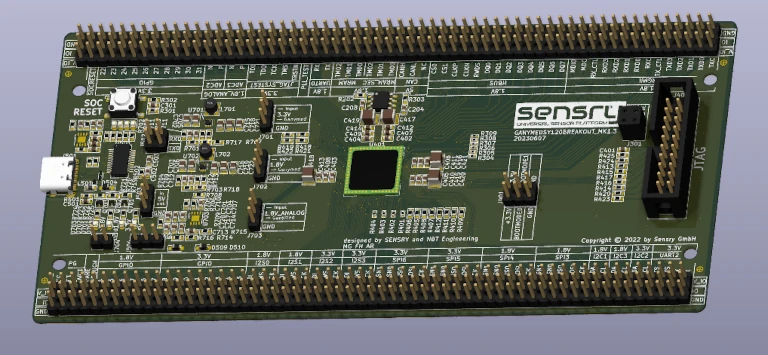
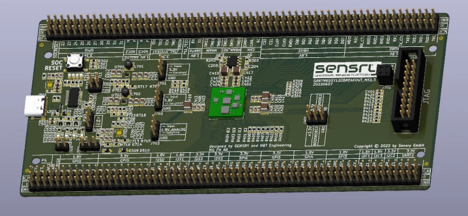

.. _ganymed_bob:

Ganymed BOB
############

Overview
********

.. note::

   All software for the Ganymed BOB is experimental and hardware availability
   is restricted to the participants in the limited sampling program.

The Ganymed BreakOut Board hardware provides
support for the Ganymed SY1xx series IoT multicore RISC-V SoC with optional sensor level.

The SoC has the following core features:

* 32-Bit RSIC-V 1+8-core processor, up to 500MHz
  * 1x Data Acquisition Unit
  * 8x Data Processing Unit
  * Event Bus
  * MicroDMA
* 4096 KB Global SRAM
* 64 KB Secure SRAM
* 512 KB Global MRAM
* 512 KB Secure MRAM
* CLOCK
* RAM
* :abbr:`32x GPIO (General Purpose Input Output)`
* :abbr:`4x TWIM (I2C-compatible two-wire interface with MicroDMA)`
* 4x I2S
* :abbr:`7x SPI (Serial Peripheral Interface with MicroDMA)`
* :abbr:`3x UART (Universal receiver-transmitter with MicroDMA)`
* :abbr:`1x TSN (Time sensitive networking ethernet MAC with MicroDMA)`
* 1x CAN-FD
* 3x ADC

     Ganymed BOB with SY120-GBM(Credit: Sensry)

     Ganymed BOB (Credit: Sensry)

Hardware
********

The BreakOut Board has:

* Assembled SoC of the Sensry Ganymed SY1xx series w/ (GENx) or w/o (GMB) top level sensors

  * SY120-GBM - Generic Base Module without top level sensors
  * SY120-GEN1 - Generic Module with top level sensors (Bosch BME680 - SPI1 , Bosch BMA456 - SPI0, Bosch BMG250 - SPI2, STMicro MIS2DH - I2C0)

* power section for on-board power generation (selectable)
* 40-pin JTAG connector (compatible to Olimex ARM-JTAG-OCD-H)
* USB over FTDI (connected to UART0)
* Header for I/Os and additional configuration

Supported Features
==================

The variant ``ganymed-bob/sy120-gbm`` board configuration supports the following
hardware features:

+-----------+------------+----------------------+
| Interface | Controller | Driver/Component     |
+===========+============+======================+
| SAADC     | on-chip    | adc                  |
+-----------+------------+----------------------+
| CLOCK     | on-chip    | clock_control        |
+-----------+------------+----------------------+
| MRAM      | on-chip    | flash                |
+-----------+------------+----------------------+
| GPIO      | on-chip    | gpio                 |
+-----------+------------+----------------------+
| TWIM      | on-chip    | i2c                  |
+-----------+------------+----------------------+
| PWM       | on-chip    | pwm                  |
+-----------+------------+----------------------+
| GRTC      | on-chip    | counter              |
+-----------+------------+----------------------+
| RTT       | Segger     | console              |
+-----------+------------+----------------------+
| SPI(M/S)  | on-chip    | spi                  |
+-----------+------------+----------------------+
| SPU       | on-chip    | system protection    |
+-----------+------------+----------------------+
| UART      | on-chip    | serial               |
+-----------+------------+----------------------+
| TSN       | on-chip    | ethernet MAC         |
+-----------+------------+----------------------+
| CAN       | on-chip    | CAN                  |
+-----------+------------+----------------------+

Other hardware features have not been enabled yet for this board.

The variant ``ganymed-bob/sy120-gen1`` board configuration supports additionally to the ``ganymed-bob/sy120-gbm`` the following
hardware features:

+-----------+------------+----------------------+
| Interface | Controller | Driver/Component     |
+===========+============+======================+
| BME680    | on-chip    | environment sensor   |
+-----------+------------+----------------------+
| BMA456    | on-chip    | acceleration sensor  |
+-----------+------------+----------------------+
| BMG250    | on-chip    | gyrosope sensor      |
+-----------+------------+----------------------+
| MIS2DH    | on-chip    | vibration sensor     |
+-----------+------------+----------------------+

Other hardware features have not been enabled yet for this board.

Power
*************************

* USB type-C
* external 5V power source

Programming and Debugging
*************************

Applications for the ``ganymed-bob/sy120-gbm`` board can be
built, flashed, and debugged in the usual way. See
:ref:`build_an_application` and :ref:`application_run` for more details on
building and running.

Testing the Ganymed BreakOut Board
************************************************

Test the Ganymed with a :zephyr:code-sample:`blinky` sample.
The sample output should be:

.. code-block:: console

    Hello World! ganymed-bob/sy120-gbm
