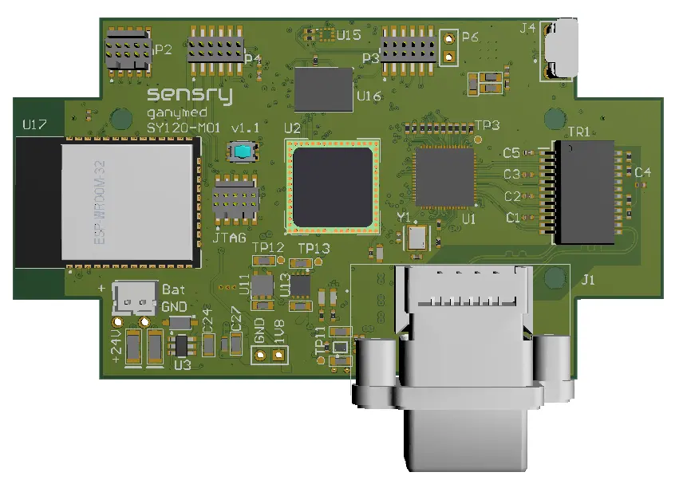

.. _ganymed_bob:

Ganymed StarterKit (SK)
#############################

Overview
********

.. note::

   All software for the Ganymed StartetKit (SK) is experimental and hardware availability
   is restricted to the participants in the limited sampling program.

The Ganymed board hardware provides support for the Ganymed sy1xx series IoT multicore
RISC-V SoC with optional sensor level.

The SoC has the following core features:

* 32-Bit RISC-V 1+8-core processor, up to 500MHz

  * 1x Data Acquisition Unit
  * 8x Data Processing Unit
  * Event Bus
  * MicroDMA

* 4096 KB Global SRAM
* 64 KB Secure SRAM
* 512 KB Global MRAM
* 512 KB Secure MRAM

     Ganymed StartetKit (SK)board  equipped with SY120 GBM (Credit: Sensry)

Board Assembly Options
**********************

The Ganymed SoC can be assembled in two variants:

  * SY120-GBM - Generic Base Module without top level sensors
  * SY120-GEN1 - Generic Module type 1 with top level sensors (Bosch BME680 - SPI1 , Bosch BMA456 - SPI0, Bosch BMG250 - SPI2, STMicro MIS2DH - I2C0)

Hardware Features
*****************

The ``ganymed-sk/sy120-gbm`` board supports the following hardware features:

* Power source via 24 V (external) or microUSB (5V)
* 10-pin JTAG connector (Olimex ARM-JTAG-OCD-H with Sensry JTAG adapter)
* USB over FTDI (connected to UART0)
* microSD slot (bottom side, connected to SPI5)
* WiFi/BLE module (connected to UART2)
* Industrial RJ45 10/100/1000BaseT Ethernet Connector
* User LED (connected to GPIO10)
* On-board sensors:
    * STMicro MIS2DH vibration sensor (connected to I2C1)
    * Stereo TDK ICS-43434 MEMS microphone (connected I2S0)

Other hardware features have not been enabled yet for this board.

The ``ganymed-bob/sy120-gen1`` board includes all hardware features of the ``ganymed-sk/sy120-gbm`` board and comes additionally
with these features:

+-----------+------------+----------------------+
| Interface | Controller | Driver/Component     |
+===========+============+======================+
| BME680    | on-chip    | environment sensor   |
+-----------+------------+----------------------+
| BMA456    | on-chip    | acceleration sensor  |
+-----------+------------+----------------------+
| BMG250    | on-chip    | gyrosope sensor      |
+-----------+------------+----------------------+
| MIS2DH    | on-chip    | vibration sensor     |
+-----------+------------+----------------------+

Other hardware features have not been enabled yet for this board.

Power
*****

* USB type-C
* external 24V power source

Programming and Debugging
*************************

Applications for the ``ganymed-sk/sy120-gbm`` board can be
built, flashed, and debugged in the usual way. See
:ref:`build_an_application` and :ref:`application_run` for more details on
building and running.

Testing the Ganymed StarterKit Board
**********************************

Test the Ganymed with a :zephyr:code-sample:`blinky` sample.
The sample output should be:

.. code-block:: console

    Hello World! ganymed-sk/sy120-gbm
